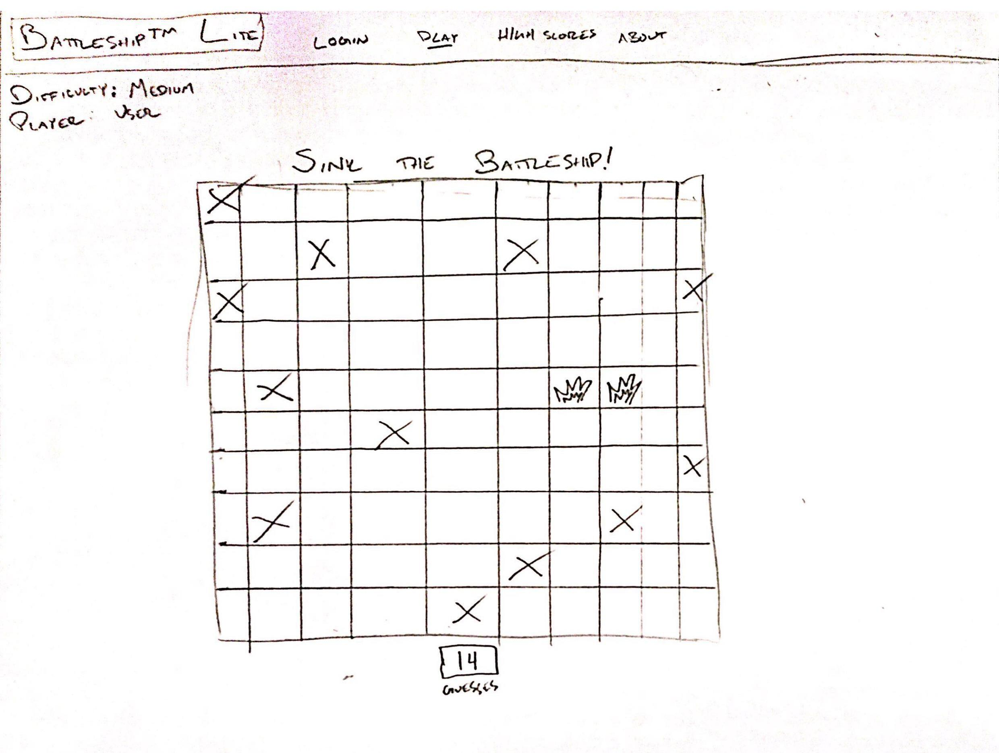

# BattleshipTM Lite

## Description deliverable

### Elevator pitch
Battleship has been a classic for several years. With the BattleshipTM Lite application, you can now experience a new twist on an old favorite. It takes the most exciting part of the game - sinking ships - out of the boring tedium of guessing turn after turn and makes it into more of a race. Play in a variety of different difficulties to find the enemy ship in as few moves as possible. Challenge your friends to see who can find the enemy in the fewest moves and claim the high score. 

### Design

### Key features

- Secure login over HTTPS
- Ability to select difficulty
- Random generation of enemy battleship location
- Ability to select squares on the grid and confirm choice
- Scores are persistently stored

### Technologies

Here is how I am going to use the required technology

- **Authentication** - User creation or logging in required to play
- **HTML** - Uses correct HTML structure for application. Four (maybe five?) HTML pages for login, play, high scores, and about pages respectively. 
- **CSS** - Application styling that looks good on different screen sizes, uses good whitespace, color choice and contrast.
- **JavaScript** - Provides login, game initialization, displaying highscores, backend endpoint calls.
- **Service** - Backend service with endpoints for:
  - login
  - retrieving scores
  - submitting scores
  - retrieving game information
- **Database Data** - Store users and scores in database.
- **Login** - Register and login users. Credentials securely stored in database. Can't play unless authenticated.
- **WebSocket** - Updates scores as other users play. Also keeps track of various scores/times of gameplay.
- **React** - Application ported to use the React web framework.
